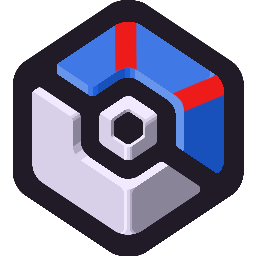

<!-- Cobbleverse Documentation -->

  

<h1 align="center">COBBLEVERSE</h1>

  The official web platform and AI-powered ecosystem for <strong>Cobbleverse</strong> — a popular Minecraft modpack built around custom mechanics, regional gym progression, custom dimensions, and long-term exploration.

---

### ❤️ The Passion Project
This website was developed as a passion project by **Harshith VNS Redrouthu** to provide the popular **Cobbleverse** modpack with a state-of-the-art, modern web presence. It brings together cutting-edge web design, serverless AI integration, and robust security protections into one unified player platform.

---

### 🌐 1. Web Development & User Experience
* **Modern Glassmorphic Design**: Built a responsive, dark-mode web application featuring glassmorphism visuals, smooth gradients, and custom micro-animations.
* **Interactive 3D Coverflow Gallery**: Engineered an interactive, hardware-accelerated 3D CSS carousel highlighting custom in-game structures, mega sites, and dimensions.
* **Internationalization (i18n)**: Implemented multi-language localization supporting seamless instant switching between English and Italian.
* **High-Speed Performance Pipeline**: Optimized high-resolution media assets with 95%+ size compression, resource preloading, and custom cache-control headers for fast load times.

---

### 🤖 2. Artificial Intelligence (AI Integration)
* **LumyBot AI Guide**: Integrated an in-page AI assistant powered by Google's **Gemini LLM** to help players navigate modpack features, item locations, and mechanics.
* **Dynamic Context Injection**: Implemented an intelligent context-retrieval system that parses user questions and injects target modpack data on demand—keeping responses accurate while saving API tokens.
* **Custom AI Guardrails**: Structured system prompts to enforce concise Markdown formatting and eliminate unnecessary conversational filler.

---

### 🛡️ 3. Cybersecurity & Platform Defense
* **Dual-Signal Anti-Abuse System**: Built a multi-layered rate-limiting engine using network signals and device fingerprinting to enforce fair daily usage and prevent quota exploitation across proxies or VPNs.
* **Strict CORS Governance**: Configured Cross-Origin Resource Sharing rules to restrict API access strictly to the official production domain, preventing unauthorized third-party site requests.
* **Zero-Trust Secret Isolation**: Isolated all backend credentials within serverless environment variables, ensuring zero exposure of sensitive keys in source code or client bundles.
* **Input Sanitization & Edge Defense**: Applied strict payload validation, request length limits, and HTTP security headers to protect serverless routes from malformed requests or injection attempts.

---

### 📁 Repository Structure

* `public/` — High-resolution logos, optimized gallery graphics, and static media assets.
* `index.html` — Main website front-end, i18n translation system, and LumyBot chat widget UI.
* `worker.js` — Cloudflare Worker backend powering LumyBot AI logic and anti-abuse protections.
* `vercel.json` — Production deployment configuration and HTTP cache headers.
* `wrangler.toml` & `wrangler.jsonc` — Edge infrastructure and KV storage bindings.
* `.gitignore` — Build artifact and environment variable exclusion rules.
